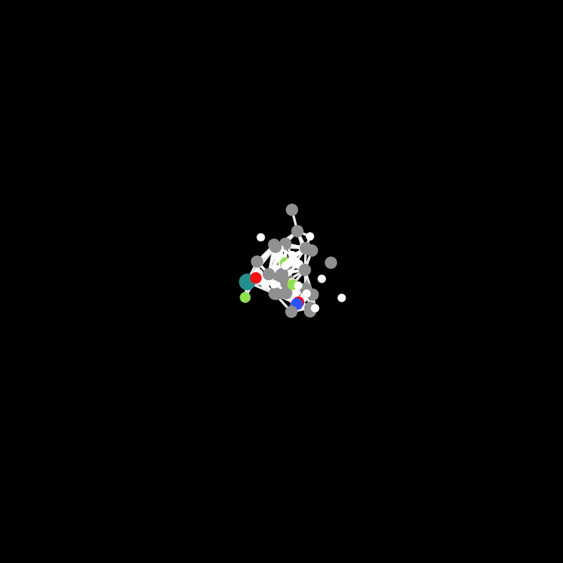
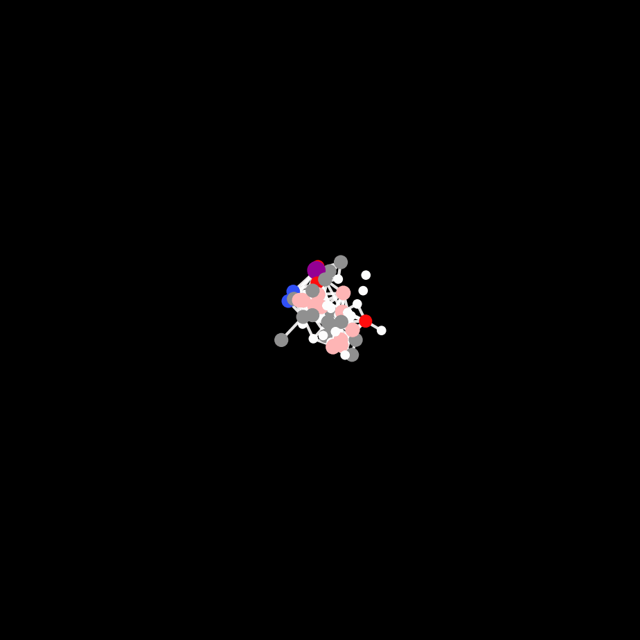
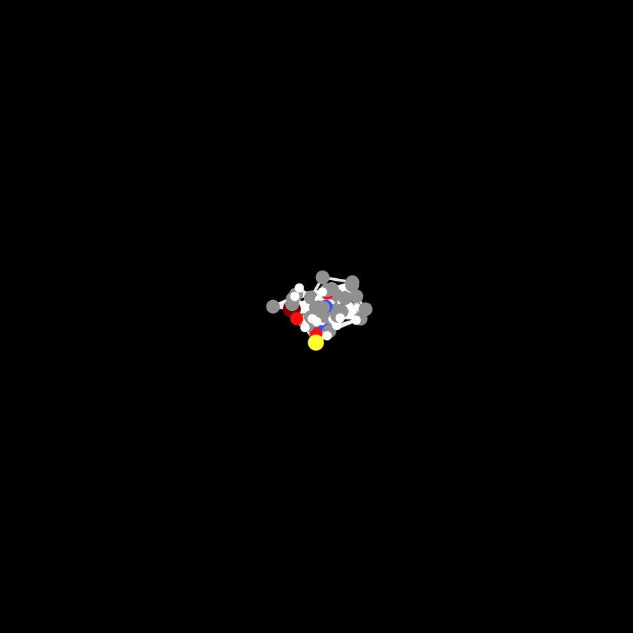
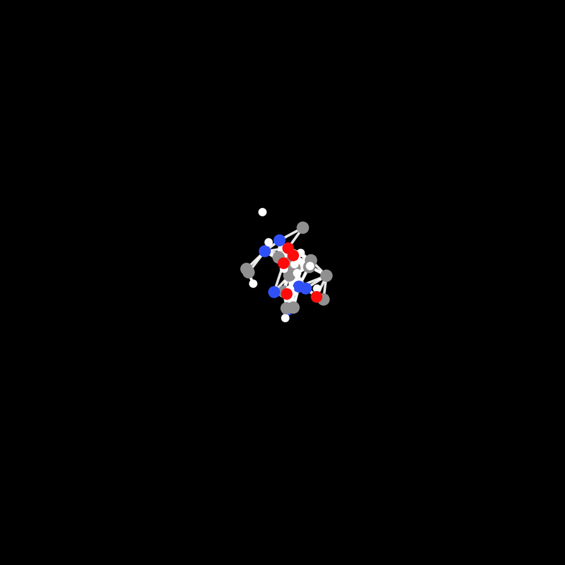

# UniTS
     

Official implementation of *"Universal transition state generation for general organic mechanistic studies"*. The corresponding paper is under review.

## 📌 Key Features
- Comprehensive Pipeline:​ UniTS combines the UniTS-Lib​ dataset with the UniTS-Gen​ model, offering a complete workflow from TS data to TS generation.
- General-Purpose Design:​ Built to handle the complexity of real-world synthetic chemistry, including organometallic catalysis and diverse reaction types.
- From 2D to 3D:​ The UniTS-Gen​ model generates accurate 3D TS geometries using only 2D molecular graphs and reactive site indices as input.

## ✨️ Showcase
Here, we display some of the generation TS trajatories (from Formula-OOS test set) from the UniTS-Gen model.

| OOS demo1 | OOS demo2 | OOS demo3 | OOS demo4 |
|:---------:|:---------:|:---------:|:---------:|
|  |  |  |  |

## 🚀 Quick Start