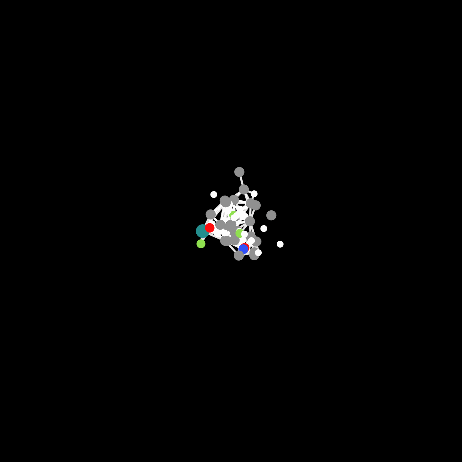
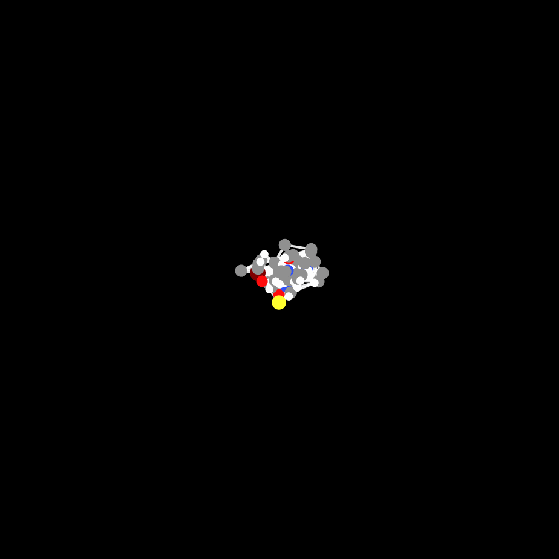
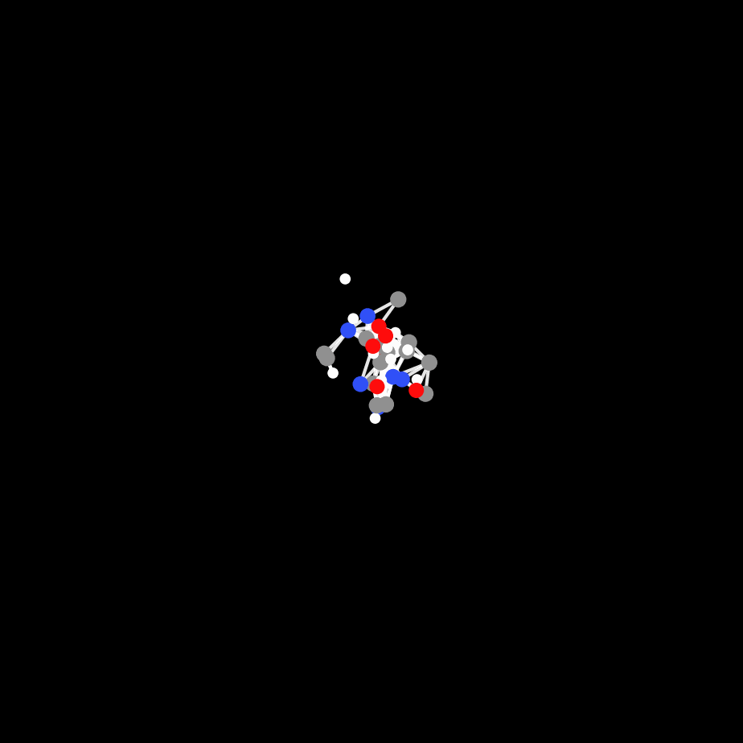

# UniTS
[](https://ubuntu.com/) [](https://www.python.org/) [](https://pytorch.org/) [](https://pytorch-geometric.readthedocs.io/) [](https://www.rdkit.org/) [](https://opensource.org/licenses/MIT)

The corresponding paper is under review. Preprint version is available at [ChemRxiv](https://chemrxiv.org/doi/full/10.26434/chemrxiv.10001667/v2). Here, we provide a [wiki document](https://deepwiki.com/licheng-xu-echo/UniTS), which was auto-generated by DeepWiki based on latest commit.

## 📌 Key Features
- Comprehensive Pipeline:​ UniTS combines the UniTS-Lib​ dataset with the UniTS-Gen​ model, offering a complete workflow from TS data to TS generation.
- General-Purpose Design:​ Built to handle the complexity of real-world synthetic chemistry, including organometallic catalysis and diverse reaction types.
- From 2D to 3D:​ The UniTS-Gen​ model generates accurate 3D TS geometries using only 2D molecular graphs and reactive site indices as input.

## ✨️ Showcase
Here, we display some of the generation TS trajatories (from Formula-OOS test set) from the UniTS-Gen model.

| OOS demo1 | OOS demo2 | OOS demo3 | OOS demo4 |
|:---------:|:---------:|:---------:|:---------:|
|  |  |  |  |

## 🚀 Quick Start
### Prepare environment
Current installation commands are tested for `PyTorch 2.4.0 + CUDA 12.4 + PyG cu124` and `PyTorch 2.8.0 + CUDA 12.8 + PyG cu128` only. You may switch versions if needed, but compatibility is not guaranteed.

```
conda create -n units python=3.11
conda activate units
git clone https://github.com/licheng-xu-echo/QCBot.git
cd QCBot
pip install .
cd ..
git clone https://github.com/licheng-xu-echo/UniTS.git
cd UniTS
unzip MolOP-main.zip
cd MolOP-main
pip install -e .
cd ..
# before installing units, please download the UniTS-Gen model weights into units/model_path as described below
```
**Note**: All codes were tested under Ubuntu 22.04.2 LTS

### Download model weights and dataset

Option 1: download from modelscope (recommended)
```bash
pip install modelscope
# download all model checkpoints
modelscope download --model 'XuLiCheng2025/UniTS-Gen-v1' --include 'model_path/*' --local_dir './units'
# download specific model checkpoints
modelscope download --model 'XuLiCheng2025/UniTS-Gen-v1' --include 'model_path/units_hiegnn/*' --local_dir './units'
# download dataset
modelscope download --model 'XuLiCheng2025/UniTS-Gen-v1' --include 'dataset/*' --local_dir '.'
```

Option 2: download from figshare

All model weights and preprocessed datasets are also available via our [figshare](https://figshare.com/s/31bd730a3834435100dc) repository. Please put these files in `model_path` and `dataset` folders, like the following structure:
```
UniTS
|── units
│   └── model_path/
│      ├── da_hiegnn/
|      ├── da_egnn/
|      ├── transition1x_hiegnn/
|      ├── transition1x_egnn/
|      ├── units_hiegnn/
|      ├── units_egnn/
|      └── ...
|── dataset
│   ├── UniTS_Lib.npy
│   └── ...
|── ...
```
### Installation

```bash
pip install . -f https://data.pyg.org/whl/torch-2.4.0+cu124.html --extra-index-url https://download.pytorch.org/whl/cu124
# Note: if your GPU supports CUDA capabilities sm_120 (e.g. RTX 5090), you should install PyTorch 2.8 + CUDA 12.8
cp pyproject_sm_120.toml pyproject.toml && pip install . -f https://data.pyg.org/whl/torch-2.8.0+cu128.html --extra-index-url https://download.pytorch.org/whl/cu128
```

## ⚛️ Model Training and Testing
```bash
# train model (single GPU)
python -u train.py --config_file ./config/train_hiegnn_unitslib_1GPU.json

# train model (multi-GPU, 2 GPUs example), "1GPU.json" also works, "2GPU.json" has larger batch_size
torchrun --nproc_per_node=2 train.py --config_file ./config/train_hiegnn_unitslib_2GPU.json
```

```bash
# sample trajactory
python -u traj_sampling.py --model_root ./model_path --model_tag units_hiegnn --batch_size 32
```

```bash
# calculate RMSD based on sampled trajactory
python -u calc_rmsd.py --result_path ./sample_traj --result_tag traj-sample-repeat-10-units_hiegnn-xxxx-xx-xx-xx-xx-xx
```

## 🛠️ Basic Usage

```bash
# From SMILES to TS initial guess
units-infer-smiles \
  --smiles '[H]C([H])([H])OCOC([H])([H])[H].[H]C1C(C([H])=O)C([H])([H])C([H])([H])C([H])([H])C1([H])[H]' \
  --reactive_atom_idx 5,12 \
  --charge 0 \
  --multi 1 \
  --model_type units_hiegnn \
  --num_samples 10 \
  --output_dir ./ts_initial_guess

# Save whole generation trajactory
units-infer-smiles \
  --smiles '[H]C([H])([H])OCOC([H])([H])[H].[H]C1C(C([H])=O)C([H])([H])C([H])([H])C([H])([H])C1([H])[H]' \
  --reactive_atom_idx 5,12 \
  --charge 0 \
  --multi 1 \
  --model_type units_hiegnn \
  --num_samples 10 \
  --output_dir ./ts_initial_guess \
  --save_full_trajectory True

# Multi-SMILES
units-infer-smiles \
  --smiles 'SMILES1' 'SMILES2' \
  --reactive_atom_idx site11,site12,site13 site21,site22  \
  --charge chrg1 chrg2 \
  --multi multi1 multi2 \
  --model_type units_hiegnn \
  --num_samples 10 \
  --output_dir ./ts_initial_guess
```
Some usefull notebooks can be found in [notebook](https://github.com/licheng-xu-echo/UniTS/tree/main/notebook) folder. IRC results can be found in [irc_of_formula_oos_test_set](https://github.com/licheng-xu-echo/UniTS/tree/main/results/irc_of_formula_oos_test_set) folder.
## 📚 Citation
If you find this code useful in your research, please consider citing our preprint before the official publication: 

Li-Cheng Xu, Junyi An, Weiqi Liu, et al. A unified framework for automated transition state generation to accelerate mechanistic exploration in organic synthesis. *ChemRxiv* **2026**, DOI: 10.26434/chemrxiv.10001667/v2.

```
@article{xu_2026_units,
    author = {Li-Cheng Xu  and Junyi An  and Weiqi Liu  and Yun-Fei Shi  and Chong-Lei Ji  and Fenglei Cao  and Yuan Qi },
    title = {A unified framework for automated transition state generation to accelerate mechanistic exploration in organic synthesis},
    journal = {ChemRxiv},
    volume = {2026},
    number = {0521},
    pages = {},
    year = {2026},
    doi = {10.26434/chemrxiv.10001667/v2},
    URL = {https://chemrxiv.org/doi/abs/10.26434/chemrxiv.10001667/v2},
    eprint = {https://chemrxiv.org/doi/pdf/10.26434/chemrxiv.10001667/v2}}
```
